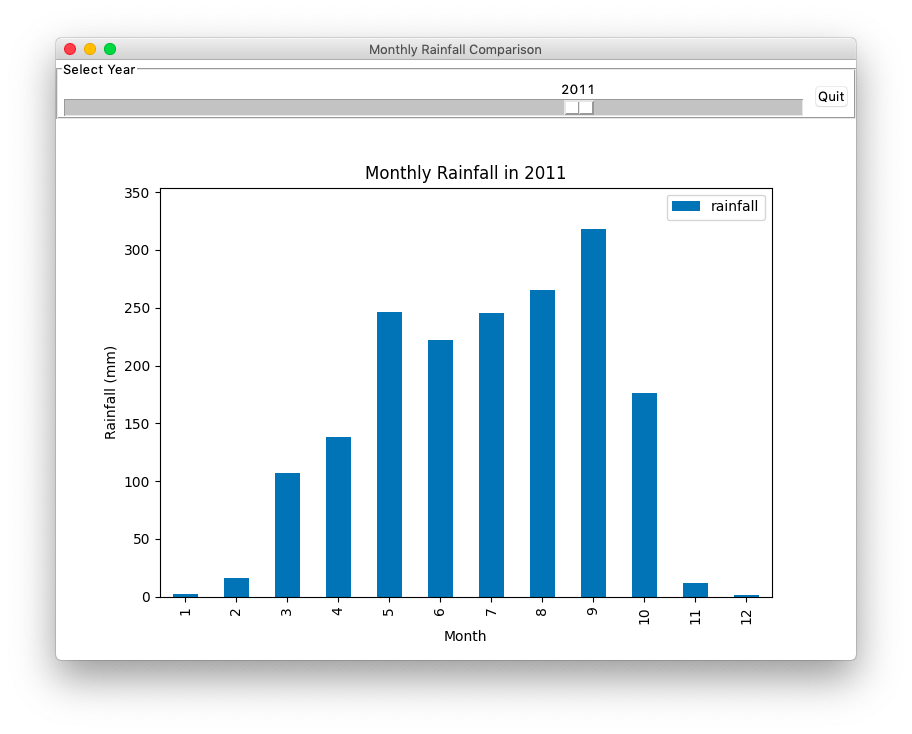

# Task (Aj.Chaiporn's Part) [25 Points]

Write a GUI application that processes and displays historical rainfall
statistics of the upper Chaophraya river basin.  The data is loaded from the
input file `rainfall.csv` residing in the same folder as the application code,
`app.py`.  Each line of `rainfall.csv` consists of three fields:

1. Field `year` specifies the year in A.D.
2. Field `month` specifies the month number, e.g., 1 for January, 2 for
   February, and so on.
3. Field `rainfall` indicates the monthly rainfall amount in mm during the
   month and year specified by the first two columns.

The provided `app.py` contains some starting code that already creates and arranges
all the required GUI widgets for you.  However, there is no data processing and
visualizing logic yet.

Your task is to complete `app.py` so that it works as follows:
* [5] The slider's range is set to the range of years found in `rainfall.csv`.  DO
    NOT hardcode the year range with constants.
* [5] Whenever the slider is changed, the bar chart is displayed with monthly
    rainfall amounts from the selected year.
* [5] When the application starts, the slider is set to the earliest year, with
    the bar chart showing the data of that year.
* [5] Set y-axis limit to the maximum value found in the `rainfall` column.
    DO NOT hardcode the limit with a constant.
* [5] Set x-axis and y-axis labels to "Month" and "Rainfall (mm)",
    respectively.  And set the chart's title to "Monthly Rainfall in *xxx*",
    where *xxx* is the selected year.

Your application should look similar to the screenshot:

## Submission
* Create a commit with the file `app.py`, then push it to GitHub.
* You may make as many commits as you'd like, but only the newest
  commit made before the exam's deadline will be used for grading.
* It's a good idea to check that GitHub has your final submission.
