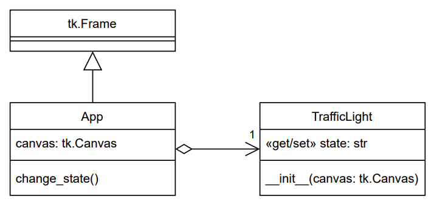
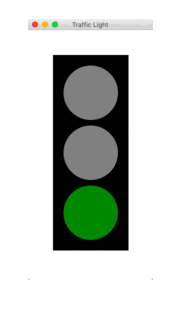

# Tasks (Aj.Chaiporn's Part) [25 Points]

1. [15 points] Complete the traffic light application in the folder `task1` by
   implementing the class `TrafficLight` in the file `task1/traffic_light.py`.  The
   application's design is shown in the class diagram below.

    

   Here are the requirements:
    * [5] The `TrafficLight` class takes a Tk's canvas object during
        initialization and draws graphical items resembling a traffic light.
    * [8] A `TrafficLight` object maintains a property `state` that can be
        assigned a string value.  Possible values are "red", "yellow",
        "green", and `None`.  When "red", "yellow", or "green" is assigned to
        `state`, the traffic light drawing must show the red,
        yellow, or green circle lighting up, respectively, while the other
        circles are shown in grey.  When `state` is assigned with `None`, all
        the circles will turn grey.
    * [2] If a value other than "red", "yellow", "green", or `None` is given,
        a `ValueError` exception is raised.

   DO NOT modify `app.py`.  However, you may assume that the canvas has a
   fixed size of 250x500 pixels.  When done correctly, running `app.py` will
   display the following animation.

    


2. [10 points] Suppose a button is created with a callback to a long-running
   function, as shown:

    ```
    import tkinter as tk

    def long_task():
        # do something that takes a very long time

    root = tk.Tk()
    btn = tk.Button(root, text="Run", command=long_task)
    btn.pack()
    root.mainloop()
    ```

    Use the file `task2.md` to answer the following:
    * [4] Explain the reason why the application appears to freeze when clicking
        the *Run* button.
    * [6] Explain <u>two</u> different techniques to keep the GUI application responsive.


## Submission
* Create a commit with the file `task1/traffic_light.py` and `task2.md`, then
  push it to GitHub.
* You may make as many commits as you'd like, but only the newest
  commit made before the exam's deadline will be used for grading.
* It's a good idea to check that GitHub has your final submission.
