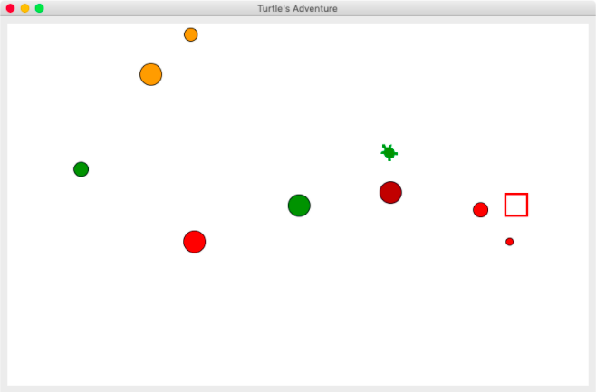
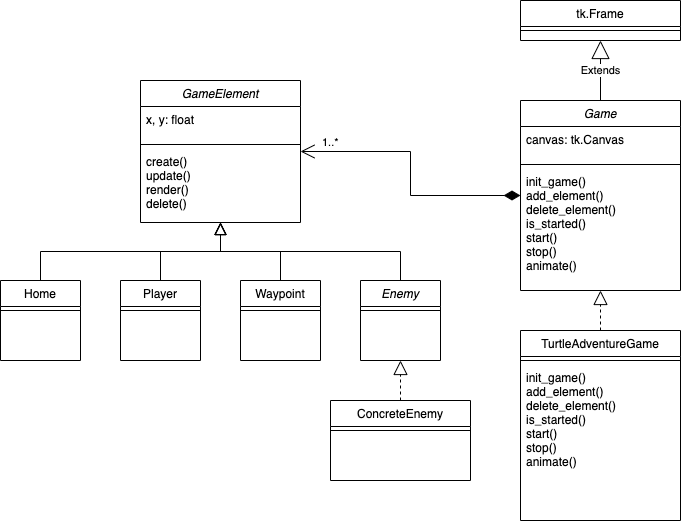

# Turtle's Adventure

In this assignment, you are to implement a simple graphical adventure game
based on Tkinter's canvas and turtle graphics.

The game consists of a turtle character that the player can control with a
mouse.  The player clicks on the canvas to set a waypoint for the turtle to
walk to.  The goal of the game is to bring the turtle back to his home,
depicted by the brown square.  However, several enemies, presented by circles
of various colors, are lurking around in the area.  Some may stay still, while
others may move in certain patterns.  If the turtle gets hit by one of them,
he is dead and the player loses the game.  If the turtle arrives at the red
square, the player wins.  The game ends once the **player** loses or wins.

## Class Diagram

## Your Task

Your task is to modify the code in `enemies.py` to implement enemies into the
game by defining various classes that extend the `GameElement` abstract class.
In addition, you must complete the definition of `EnemyGenerator` class to
schedule creation of enemies of certain kinds.

You are required to implement at least *four* types of enemies as follows:

* `RandomWalkEnemy` - will walk randomly on the screen.
* `ChasingEnemy` - will try chasing the player.  Try not to move
  this enemy too fast, otherwise the player will have no chance to win.
* `FencingEnemy` - will walk around the home in a square-like pattern.
* `???Enemy` - this last kind of enemy is to be designed and named on your
  own.
